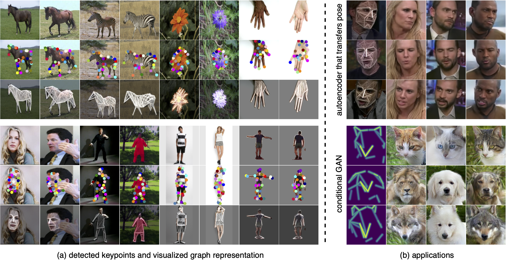

# AutoLink: Self-supervised Learning of Human Skeletons and Object Outlines by Linking Keypoints (NeurIPS 2022)



> **AutoLink: Self-supervised Learning of Human Skeletons and Object Outlines by Linking Keypoints** <br>
> [Xingzhe He](https://xingzhehe.github.io/), [Bastian Wandt](http://bastianwandt.de/), and [Helge Rhodin](http://helge.rhodin.de/) <br>
> *Thirty-sixth Conference on Neural Information Processing Systems* (**NeurIPS 2022**)

[[Paper](https://arxiv.org/abs/2205.10636)][[Website](https://xingzhehe.github.io/autolink/)]

## Setup

##### Setup environment

```
conda create -n autolink python=3.8
conda activate autolink
pip install -r requirements.txt
```

##### Download datasets

The [CelebA-in-the-wild](https://mmlab.ie.cuhk.edu.hk/projects/CelebA.html), [Taichi](https://github.com/AliaksandrSiarohin/motion-cosegmentation), [Human3.6m](http://vision.imar.ro/human3.6m/description.php), [DeepFashion](https://github.com/theRealSuperMario/unsupervised-disentangling/tree/reproducing_baselines/original_code/custom_datasets/deepfashion), [CUB](http://www.vision.caltech.edu/visipedia/CUB-200-2011.html), [11k Hands](https://sites.google.com/view/11khands), [AFHQ](https://github.com/clovaai/stargan-v2), [Horse2Zebra](https://www.kaggle.com/datasets/balraj98/horse2zebra-dataset) and [Flower](https://www.robots.ox.ac.uk/~vgg/data/flowers/102/index.html) can be found on their websites. We provide the pre-processing code for CelebA-in-the-wild, CUB and Flower to make them `h5` files. Others can be used directly.

##### Download pre-trained models

The pre-trained models can be downloaded from [Google Drive](https://drive.google.com/drive/folders/1XTY0rZ2uO3BYV7Jxp13IOaAcmKBJ7RmA?usp=sharing).

## Testing

To numerically test the model performance, run

```
python test.py --log celeba_wild/celeba_wild_k8_m0.8_b16_t0.0025_sklr512 --data_root data/celeba_wild
```

where, 

- `--log` specifies the checkpoint folder under `checkpoints/`,
- `--data_root` specifies the location of the dataset, 

Therefore, the above command will give the performance metric on CelebA-in-the-wild, which is described in the paper.

You can also qualitatively test the model.

```
python gen_detection.py --log log/celeba_wild_k8_m0.8_b16_t0.0025_sklr512 --folder_name celeba_wild_k8_detection --data_root data/celeba_wild
```

where,

- `--folder_name` specifies the folder where you want to save the detection images.

## Training

To train our model on CelebA-in-the-wild, run

```
python train.py --n_parts 8 -missing 0.8 --block 16 --thick 2.5e-3 --sklr 512 --data_root data/celeba_wild -dataset celeba_wild
```

where, 

- `--n_parts` specifies the number of keypoints,
- `--missing` specifies the ratio of the image masking,
- `--block` specifies number of patches to divide the image in one dimension,
- `--thick` specifies thickness of the edges,
- `--sklr` specifies the learning rate of the edge weights,
- `--data_root` specifies the location of the dataset,
- `--dataset` specifies name of the dataset.

The trained model can be found in `checkpoints/celeba_wild_k8_m0.8_b16_t0.0025_sklr512`.

## Citation

```
@inproceedings{he2022autolink,
    title={AutoLink: Self-supervised Learning of Human Skeletons and Object Outlines by Linking Keypoints},
    author={He, Xingzhe and Wandt, Bastian and Rhodin, Helge},
    booktitle={Advances in Neural Information Processing Systems},
    year={2022}
}
```